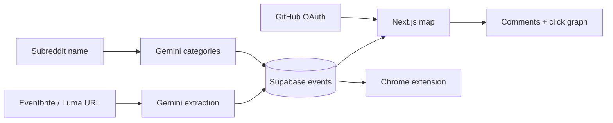

# Ongod

**Find your tribe IRL.**

Ongod turns communities you already belong to — a subreddit, a GitHub graph, a shared interest — into a map of real-world events you can actually show up to.

It received an **honorable mention** at [HackOMania 2025](https://hackomania2025.geekshacking.com/#challenges), GeeksHacking’s 24-hour hackathon, for the **Geek Connect: Find Your Tribe IRL** challenge.

[Live demo](https://hack-o-mania-ongod.vercel.app) · [HackOMania 2025](https://hackomania2025.geekshacking.com/#challenges)

<p>
  
  
  
  
  
  
</p>

## The challenge

HackOMania 2025 asked teams to help people step out of purely digital life and meet their people in the real world. Online communities are easy to join and hard to meet: a subreddit can have hundreds of thousands of members and still feel empty on a Saturday night in Singapore.

Ongod is our answer. Keep the internet communities you already love, then walk into the room.

## What it does

1. **Stay where you already are.** A Chrome extension reads the subreddit you are browsing and injects matching IRL events into the page.
2. **Events categorize themselves.** Gemini tags both events and subreddits, then we match them.
3. **Your graph comes with you.** Sign in with GitHub to see who in your network already clicked through to an event.
4. **Anyone can add a meetup.** Paste a public Eventbrite or Luma URL. No admin form, no spreadsheet.

## Product

### Event map (`hackomania-ongod`)

- Interactive [Mapbox](https://www.mapbox.com/) map centered on Singapore
- Event list with price filters, date range, and hover-to-fly map transitions
- Event detail with description, comments, and GitHub-network social proof
- One-link ingest from Eventbrite and Luma, parsed by Gemini
- GitHub OAuth via Supabase
- Light and dark themes

### Reddit extension (`reddit-extension-2`)

- Manifest V3 Chrome extension
- Injects the Ongod map into `reddit.com/r/*` for the current subreddit
- Popup lists upcoming events for that community

`reddit-extension` is an earlier prototype and is not maintained.

## How it works



1. A submitted event URL is fetched and parsed into structured fields: title, time, address, coordinates, price, and categories.
2. The first time a subreddit is seen, it is categorized the same way.
3. Events and subreddits that share categories are paired.
4. The web app and the extension both read from the same Supabase tables.

## Repository

```
HackOMania-Ongod/
├── hackomania-ongod/      Next.js 15 app — map, ingest, auth, comments
├── reddit-extension-2/    Chrome extension (current)
└── reddit-extension/      Early prototype (not maintained)
```

## Getting started

### Web app

```bash
cd hackomania-ongod
cp .env.example .env.local
npm install
npm run dev
```

Open [http://localhost:3000](http://localhost:3000).

Required environment variables are listed in [`hackomania-ongod/.env.example`](hackomania-ongod/.env.example):

| Variable | Purpose |
| --- | --- |
| `NEXT_PUBLIC_SUPABASE_URL` | Supabase project URL |
| `NEXT_PUBLIC_SUPABASE_ANON_KEY` | Supabase anonymous key |
| `NEXT_PUBLIC_MAPBOX_ACCESS_TOKEN` | Mapbox public token |
| `GEMINI_API_KEY` | Google Gemini key for event and subreddit parsing |

Enable GitHub as an auth provider in Supabase and set the redirect URL to `/api/auth/callback`.

### Chrome extension

```bash
cd reddit-extension-2
cp .env.example .env
npm install
npm run build
```

In Chrome, open `chrome://extensions`, enable Developer mode, and load the `reddit-extension-2/build` folder.

The extension talks to the same Supabase project. See [`reddit-extension-2/.env.example`](reddit-extension-2/.env.example).

## Tech stack

| Layer | Tools |
| --- | --- |
| Web app | Next.js 15, React 19, Tailwind CSS, shadcn/ui |
| Map | Mapbox GL, react-map-gl |
| Data | Supabase (Postgres, Auth) |
| AI | Google Gemini 2.0 Flash |
| Extension | Vite, React, Chrome Manifest V3 |
| Deploy | Vercel ([live app](https://hack-o-mania-ongod.vercel.app)) |

## Team Ongod

Built in 24 hours at HackOMania 2025.

- [Jovan Tan](https://github.com/jovantan88)
- [Ethan Sim](https://github.com/simethan)
- [Glenn](https://github.com/wuglenn)
- [Kris](https://github.com/futonkris)
- Robert Scott

## License

MIT. See [LICENSE](LICENSE).
